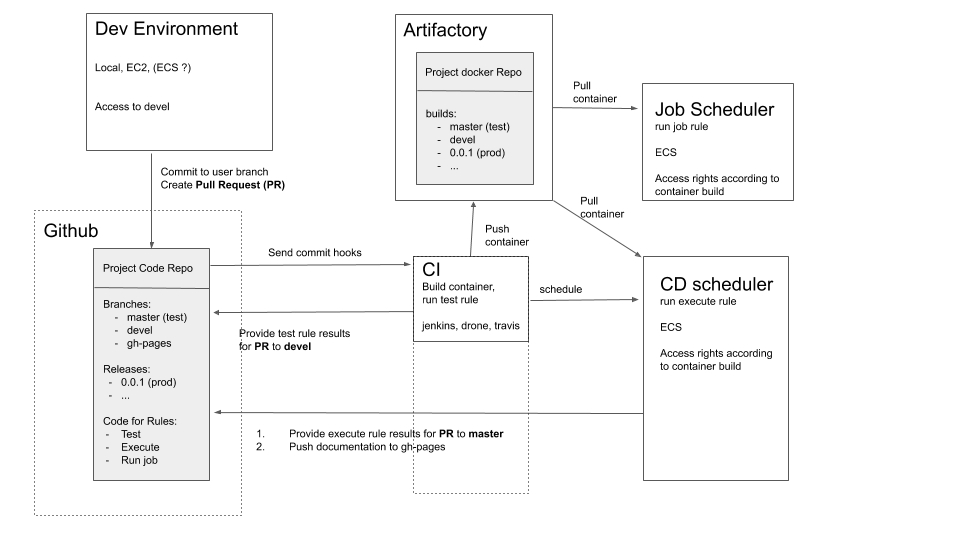

[](https://snakemake.readthedocs.io)
[](https://travis-ci.org/github/erblast/cookie_ds)

# Cookiecutter Data Science template using Snakemake Docker R and python

inspired by:
- [cookiecutter data science](https://drivendata.github.io/cookiecutter-data-science/)
- [cookiecutter-docker-science](https://github.com/docker-science/cookiecutter-docker-science) (python + make + docker)
- [drake-gitlab-docker-example](https://gitlab.com/ecohealthalliance/drake-gitlab-docker-example) (R + make + drake + docker)

# Demo

[cookie_ds_demo repository](https://github.com/erblast/cookie_ds_demo)

# Features:
- CI/CD using travis
- control execution via `snakemake`
- `docker-compose` spins up `RStudio`, `jupyter notebook` and `jekyll`(for github page rendering) server containers
- templates for **test**, **exec** and **job** rules 
- automated documentation builds as github page including snakemake reports, pkgdown website, DAG diagrams of executed workflows and more

# Why use `docker` ?


[data science repo life cycle](https://docker-science.github.io/)

Docker allows us to continuously develop data science applications in the same environment it will be deployed in.


# Why use `cookiecutter` ?

Adding features to a repo that make it deployment ready such as unit testing, CI/CD, automated documentation and logging can be quite laborious and requires some planning. An effort usually not done for ad-hoc analysis. Using a good template makes that effort reusable and we can theoreticall apply it even to small ad-hoc projects without any extra work.


# Why use `snakemake` ?

`snakemake` is an execution manager that tracks file history and only executes those part of the code that have changed since the last run. It is baed on `python` and can integrate `R`, `python` and `shell` commands equally well. It can assign multiple cores to rules that can be executed in parallel and builds sophisticated `html` reports of completed runs.


# Template Folder Structure
```
├── .doc_templates                                # files needed to render gh-page
├── config                                        # folder for configurations files
│   ├── config.yml                                # parameters that should be accessed by snakemake
│   └── config_exec.yml                           # parameters that should be accessed from within scripts
├── data                                          # data folders --docker ignored 
│   ├── in                                 
│   │   └── feather
│   ├── out                                       # --git ignored
│   │   └── feather
│   └── proc                                      # --git ognored
│       └── feather
├── debug                                         # debug folder for R scripts
├── docker                                        # additional dockerfiles 
│   └── jupyter.dockerfile                        # builds image with jupyter nb server using envs/{{cookiecutter.project_slug}}_conda.yml
├── docs                                          # documentation --docker and git ignored
│   ├── env                                       # conda and R environment
│   ├── html                                      # all html files generated by all rules
│   ├── png                                       # all png files generated by all rules
│   ├── snakemake_report                          # html snakemake run reports
│   ├── testlog                                   # unit test results
│   ├── wflow                                     # DAG workflow renderings of rules in png format
│   └── {{cookiecutter.r_pkg_name}}               # R package pkgdown website
├── envs                                          # yml files with conda environment specifications
│   └── {{cookiecutter.project_slug}}_conda.yml   # packages from this file will be installed into project and jupyter server container  
├── rules                                         # additional snakemake rules
│   ├── job.snakefile.py
│   └── test.snakefile.py
├── src                                           # all repository code
│   ├── R
│   ├── Rmd
│   ├── nb                                        
│   │   ├── executed                              # exeuted jupyter notebooks      -- do not edit by hand
│   │   └── vanilla                               # not executed jupyter notebooks -- edit
│   ├── py                                        
│   └── {{cookiecutter.r_pkg_name}}               # embedded R package for unit testing
├── .dockerignore
├── .gitignore
├── .travis.yml
├── Dockerfile
├── README.md
├── Snakefile
└── docker-compose.yml

```

# Deployment

We distinguish between three types of code/commands that can be executed within the container **test**, **exec** and **job**

Code in **test** shoulld be leightweight and execute in minutes. It usually executes unit tests of packaged functions and objects and renders package documentation

Code in **exec** should accesses a inmutable data. It can contain static experiments or code for training models. 
Critical parts should be packaged and unit tested. This step is allowed to take up many computational ressources.

The **job** rule in this demo repo does not do much. Code executed by a **job** rule should have a very high test coverage and configuration should be expressive using envirnment variables, rather than hidden in config files. Should be used for accessing data that periodcially refreshes and is allowed to take up many computationanl ressources. A typical application would be to generate predictions from a pre-trained model on new data.

These rules could be used to set up this deployment strategy



# Automated Documentation

the folders `docs/` and `data/` were added to `.gitignore` because there content is dependent on code execution which can easily be forgotten before commiting to git. Data input and output is preferably stored outside the repo in a database or another form of remote data storage. The documentation containing reports, plots and references can be added automatically deployed to a separate branch in the code repository.

For example travis can be set-up to publish the content of the `docs/` folder to the `gh-pages` branch.

- enable gitpage rendering in github repository settings, and publish to gh-pages branch
- follow these [instructions](https://www.r-bloggers.com/continuous-deployment-of-package-documentation-with-pkgdown-and-travis-ci/) to set configure travis.


**For more details checkt the [cookie_ds_demo repository](https://github.com/erblast/cookie_ds_demo)**