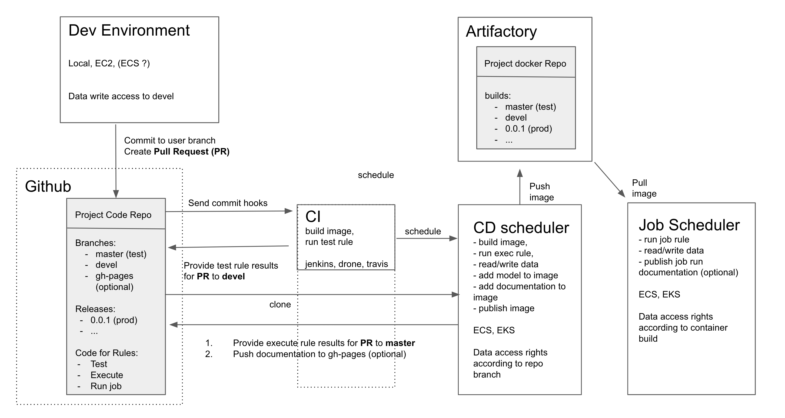

[](https://snakemake.readthedocs.io)
[](https://travis-ci.org/github/erblast/cookie_ds)

# `cookiecutter` Data Science Template using `snakemake`, `docker`, `R` and `python`

inspired by:
- [cookiecutter data science](https://drivendata.github.io/cookiecutter-data-science/)
- [cookiecutter-docker-science](https://github.com/docker-science/cookiecutter-docker-science) (`python` + `make` + `docker`)
- [drake-gitlab-docker-example](https://gitlab.com/ecohealthalliance/drake-gitlab-docker-example) (`R` + `make` + `drake` + `docker`)

# Demo

[cookie_ds_demo repository](https://github.com/erblast/cookie_ds_demo)

# Usage

[see cookiecutter documentation](https://cookiecutter.readthedocs.io/en/1.7.0/)

```
cookiecutter https://github.com/erblast/cookie_ds
```

# Requirements
- `docker`
- `docker-compose 3.7`   
- `docker` base images need to be based on [`rocker/verse`](https://hub.docker.com/r/rocker/verse/) images.

# Features:

- CI/CD using `travis`
- control execution via `snakemake`
- `docker-compose` spins up `RStudio`, `jupyter notebook` and `jekyll`(for github page rendering) server containers
- automated documentation builds as `github` page including:
    * `snakemake` reports
    * `pkgdown` website (documentation for packaged `R` functions)
    * DAG diagrams of executed workflows
    * R and python environment
    * unit test results
    * all `html` and `png` code execution byproducts
- `R` and `python` language support
- seperate deployment ststages into diffent rules: 
    * **test** for CI
    * **exec** for CD 
    * **job** for regularly schedules production runs

# Why use `docker` ?


A good discription of the advantages of a `docker`-based workflow can be found [here](https://docker-science.github.io/)

`docker` allows us to continuously develop data science applications in the same environment it will be deployed in.

- [`RStudio` `docker` tutorial](https://ropenscilabs.github.io/r-docker-tutorial/02-Launching-Docker.html)
- [`jupyter notebook` `docker` tutorial](https://jupyter-docker-stacks.readthedocs.io/en/latest/index.html)

# Why use `cookiecutter` ?

Adding features to a repo that make it deployment ready such as unit testing, CI/CD, automated documentation and logging can be quite laborious and requires some planning. An effort usually not done for ad-hoc analysis. Using a good template makes that effort reusable and we can theoreticall apply it even to small ad-hoc projects without any extra work.

[see `cookiecutter` documentation](https://cookiecutter.readthedocs.io/en/1.7.0/)


# Why use `snakemake` ?

`snakemake` is an execution manager that tracks file history and only executes those part of the code that have changed since the last run. It is baed on `python` and can integrate `R`, `python` and `shell` commands equally well. It can assign multiple cores to rules that can be executed in parallel and builds sophisticated `html` reports of completed runs. Last but not least the `yaml` based synthax of `Snakefiles` is much easier to read than most `Makefiles`.

[see snakemake documentation](https://snakemake.readthedocs.io/en/stable/index.html)

# Why use `pyhton` and `R`?

Data Scientist should be given the option to develop in their prefered language and with the flexibility of containers this can be easily fullfilled. Familiarity with a common template can help understanding code written in the other language that is not the primary choice. Therefore a python package template will be added soon.

# Template Structure

## Which folders should be commited to `git`?

Files that are produced as a result of code execution should not be commited to git. The chance of not correctly executing the code and then commiting is too great. Therefore `data/`, `docs/` and `models/` folders are added to `.gitignore`. The exception being the `data/in` subfolder as most projects usually start out with a fixed data set. During the course or the project development it is better to switch to an external data source and add `data/in` to `.gitignore` and `.dockerignore`. Following this principle any data that needs to be stored as a result of code execution should be stored within an external data source.


## Folders
```
├── .doc_templates                                # files needed to render gh-page
├── config                                        # folder for configurations files
│   ├── config.yml                                # parameters that should be accessed by snakemake
│   └── config_{rule_name}.yml                    # parameters that should be accessed from within scripts
├── data                                          # data folders
│   ├── in                                        # folder for immutable input data, add to .dockerignore and .gitignore if data can be loaded from external sources
│   │   └── feather
│   ├── out                                       # --git ignored  --docker ignored
│   │   └── feather
│   └── proc                                      # --git ognored --docker ignored
│       └── feather
├── debug                                         # debug folder for R scripts --git ignored --docker ignored
├── docker                                        # additional dockerfiles 
│   └── jupyter.dockerfile                        # builds image with jupyter nb server using envs/{{cookiecutter.project_slug}}_conda.yml
├── docs                                          # documentation  --git ignored --docker ignored
│   ├── env                                       # conda and R environment
│   ├── html                                      # all html files generated by all rules
│   ├── png                                       # all png files generated by all rules
│   ├── snakemake_report                          # html snakemake run reports
│   ├── testlog                                   # unit test results
│   ├── wflow                                     # DAG workflow renderings of rules in png format
│   └── {{cookiecutter.r_pkg_name}}               # R package pkgdown website
├── envs                                          # yml files with conda environment specifications
│   └── {{cookiecutter.project_slug}}_conda.yml   # packages from this file will be installed into project and jupyter server container 
├── models                                        # model folder  --git ignored --docker ignored
├── rules                                         # additional snakemake rules
│   ├── job.snakefile.py
│   └── test.snakefile.py
├── src                                           # all repository code
│   ├── R
│   ├── Rmd
│   ├── nb                                        
│   │   ├── executed                              # exeuted jupyter notebooks      -- do not edit by hand
│   │   └── vanilla                               # not executed jupyter notebooks -- edit
│   ├── py                                        
│   └── {{cookiecutter.r_pkg_name}}               # embedded R package for unit testing
├── .dockerignore
├── .gitignore
├── .travis.yml
├── Dockerfile
├── README.md
├── Snakefile
└── docker-compose.yml

```

# Docker 

## Image Structure

the image contains two folders for repo code:  
    -  `/app` which is empty and can be used to mount a local volume containing a local copy of the repo.   
    - `/repo` which contains the code of the repo at the time the image was built.  

Default working directory is `/app`, use `docker run -w /repo image_name` in order to execute internal code.

Default command executes **test**, **exec** and renders documentation with 1 core. Overwrite `docker run -it --rm image_name /bin/bash`

Increase number of CPU cores using the `NCPU` environment variable.  `docker run -w /repo -e NCPU=8 image_name`

For a complete list of availabele commands [see README of demo repo](https://github.com/erblast/cookie_ds_demo)

## Additional Images for development

the `docker/` folder contains a dockerfile in order to build a jupyter notebook server with the same packages installed as specified in {{cookiecutter.project_slug}}_conda.yml

`docker-compose.yml` will spin up

- `jupyter notebook` server
- `RStudio` server
- `jekyll` server (renders github page)

# Automated Documentation

the folders `docs/` and `data/` were added to `.gitignore` because there content is dependent on code execution which can easily be forgotten before commiting to git. Data input and output is preferably stored outside the repo in a database or another form of remote data storage. The documentation containing reports, plots and references can be added automatically deployed to a separate branch in the code repository.

For example travis can be set-up to publish the content of the `docs/` folder to the `gh-pages` branch.

- enable gitpage rendering in github repository settings, and publish to gh-pages branch
- follow these [instructions](https://www.r-bloggers.com/continuous-deployment-of-package-documentation-with-pkgdown-and-travis-ci/) to set configure travis.


 [demo documentation hosted on github pages](https://erblast.github.io/cookie_ds_demo/)**

# Unit Testing

`R` functions and classes should be collected in the internal R package in `src/`. Test should be added to the appropriate `test/testthat/` folder. **test** will automatically execute all unit tests in addition to checking package consitency and code style.

for testing `python` functions and classes an internal python package should be added to the `src/` folder and appropriate extensions for the test rule and the rendering of the documentation should be added. 

# Deployment 


Deployment should be done using a CI/CD process that is controlled by branching and Pull Requests of the `github` code repository.

Data Science project deployment defers from software development deployment because the analysis code can take hours to execute. Therefore we use unit test for lightweight fast CI and reserve heavy weight analysis code execution for the CD process.

## Requirements
- controlled data read/write access
- automated documentation/logging
- unit testing 
- version control
- reproducibility


## Rules

| **rule** | **runtime** | **external data access** | **description**                            | **configuration**                  | **testing**        |
|----------|-------------|--------------------------|--------------------------------------------|------------------------------------|--------------------|
| test     | minutes     | no, simulated test data  | unit tests of packaged functions           | config.yml                         | -                  |
| exec     | hours       | read static data, write  | experiments, model training and evaluation | config.yml                         | critical functions |
| job      | hours       | read dynamic data, write | recurring jobs such as model predictions   | config.yml / environment variables | all functions      |


## Strategy
These rules could be used to set up this examplatory deployment strategy



