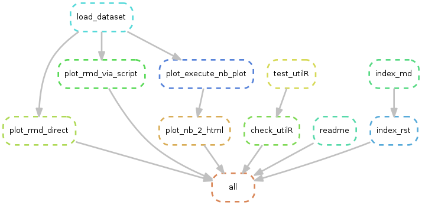

[](https://snakemake.readthedocs.io)
[]({{cookiecutter.travis_address}})
[snakemake report]({{cookiecutter.git_pages_address}}/snakemake_report/)
[]({{cookiecutter.github_repo}})

# {{cookiecutter.project_name}}

{{cookiecutter.description}}

## Run in docker container
```
docker run -it --rm -v "$PWD":/app {{cookiecutter.docker_target_image}}
```

## Docker compose

builds {{cookiecutter.docker_target_image}} if not found locally and start a shell_1 and rstudio_1 container

```
docker-compose up -d
docker container exec -it {{cookiecutter.docker_target_image}}_shell_1 /bin/bash 
docker-compose down
```

## Execute
```shell
snakemake
```

## Dryrun
```shell
snakemake -n

```

## Execute after code changes
```shell
snakemake -R `snakemake --list-code-changes`
```

## Force re-execution
```shell
snakemake -F
```

## Parallel Processing

```shell
snakemake --cores 3
```

## Execute and build conda environment

The conda environment will be reconstructed from `yml` file and stored in `./.snakemake/conda`.
A single conda environment can be defined for each rule.

```shell
conda env export --name {{cookiecutter.project_name}}_env -f ./envs/{{cookiecutter.project_name}}_env_debian.yml
```

```shell
snakemake --use-conda
```
## Test

All generalizable R functions are collected in an R package under `{{cookiecutter.project_name}}R` which is checked and tested

```
snakemake test
```


## Visualize workflow
```shell
snakemake --dag | dot -Tpng > ./docs/wflow/wflow.png
```




## Build Report

```
snakemake report # executes rules for building report building blocks
snakemake --report docs/snakemake_report/index.html
```


